#        <center><big><b> The Application of CNN and SIFT-SVM on the Chest x-ray images for the detection of COVID-19</center></big></b>
<center><small>Team Member: Jiawen Liu, Chenze Li, Xuanjun Gong </center></small>

## 1. Introduction

A worldwide and unexpected outbreak of the COVID-19 happened in 2019. And this disease is widely spread. Covid-19 is caused by SARS-CoV-2. And people could use chest x-ray to detect if one person catches covid-19. In this project, we're going to use CNN and SIFT + SVM for COVID-19  classification based on medical X-Ray Images.

## 2. Methodology

### 2.1 Convolutional Neural Network

Convolutional neural network(CNN) is one class of deep learning algorithms and one kind of supervised machine learning. CNN is widely used in computer vision and natural language processing(NLP). In this project, we're going to use CNN for COVID-19 medical X-Ray Image classification. 

- Convolutional Layer

The Convolutional Layer is related to feature extraction. In the process of convolution, the figure is treated as a matrix. And in this layer, the figure matrix is ‘convolved’ by a filter matrix. 

- Pooling Layer

The Pooling layer performs downsampling which means extracting a ‘feature’ value from a set of data, usually the maximum or the average value of all the data. The results from the convolutional layer are a very large matrix. Then people use pooling layers to reduce the dimension of the result matrix. In our case, we extract the maximum of a set of values in the pooling layer.

- Fully Connected Layer

Fully connected layer performs the task of classification and reduces the results from pooling layers which are high dimensional matrices to vectors. It contains many hidden layers and people use sigmoid or softmax as activation functions to make classification.


### 2.2 Scale-Invariant Feature Tansform (SIFT)

SIFT(scale-invariant feature transform) is an algorithm used for feature detection. It generally has four steps:
1. It applies different gaussian filters to the image, and takes the difference of gaussian (DoG) to obtain the local maximum and minimum over scale and space.
2. It removes low-contrast keypoints and edge keypoints.
4. It seperate the keypoints into a 4 * 4 sub-blocks, and for each sub-blocks, it assigns 36 histogram bins representing to the gradient magnitude in each direction to each sub-blocks, and the highest bin was taken to represent the direction for the sub-blocks. Overall, 8 bins (directions) were taken for the sub-block.
4. For each keypoints, it generate a 4 * 4 * 8 (128) vector descriptor vector were generated to represent the keypoint.


For illustration, we plotted the detected keypoints in the chest X-ray image below. In this plot, each colored dot is a detected keypoints by sift algorithm. And as shown in this plot, the majority of the keypoints are scattered around the middle of the lungs of the patients. 

**Detected sift keypoints in the chest X-ray**

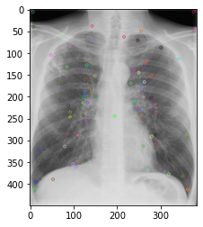


To do the classification, we used bag-of-features to construct the image embeddings. Here are the steps:
1. We construct features vocabulary by concatenate all keypoint vectors from all images in our dataset. 
2. We applied a K-mean clustering algorithm to compress the keypoint feature vovabulary into k clusters. 
3. With k clusters, we classify each features from each image into the clusters and count the frequency of the feature clusters.
4. The frequency of the feature clusters is used as the bag-of-features embeddings to represent the image.


To visualize this process, we plotted the k-mean clustered features in a 2-D space using t-distributed Stochastic Neighbor Embedding (t-SNE). And we also plotted the bag-of-feature embedding for one X-ray image as a barplot.

**Image sift feature clusters in t-SNE 2-D space**

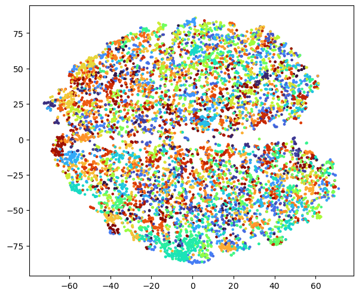

**BoF embedding for one image**

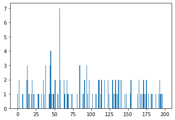

### 2.3 Support Vector Machine

We trained a support vector machine for the classification. Generally speacking, SVM is a supervised learning algorithm to find the best hyperplane to seperate the data points belonging to two classes in the embedding space. There are three notes about SVM:
1. SVM uses hinge loss for the loss function.
2. SVM uses parameter C to adjust the margin for seperating the data points. 
3. SVM uses a kernel trick which transform the low-dim space into a high-dim space for classification. 

## 3. Implementation

### 3.1 Data Resource

In this project, we use [chest x-ray imagine dataset](https://www.kaggle.com/andyczhao/covidx-cxr2?select=test.txt) from kaggle.The dataset is published by COVID-Net Open Initiative and constructed by Andy Zhao and other four collaborators. This dataset contains 15951 Chest X-Ray images in the training set  which include 2158 positive and 13793 negative. The test set contains 400 images with 200 positive cases and 200 negative cases. The text files have the following format: “patient id”, “filename”, “class” and “data source”. 


### 3.2 Imagine Preprocessing

Since the training set is unbalanced, we decided to reduce the number of negative cases in the training set. Therefore, the final training set includes 2158 positive cases and 2158 negative cases. 

Before doing classification, we do some image preprocessing. Firstly, we define the dimension of the images as $300\times300$. We apply two different numbers of batch sizes which are 32 and 64. We’ll see the difference when we do the classification. And we also perform some image augmentation techniques. We rescale these images and transform the shape of them, we also zoom the figures and flip them horizontally at random. 


### 3.3 CNN 

We begin with a lower batch size 32 and then use a higher batch size 64. The kernel size, which determines the dimensions of the kernel, is set as $3\times3$ firstly. For the convolutional layers, we use $ReLU$(rectified linear units) as activation function. The stride is $2\times2$. Max-pooling is used in the pooling layers. For the first dense layer, we set 128 units and use $ReLU$ as activation function. For the second dense layer, we use 64 for units. At the last layer, $sigmoid$ function is used as an activation function for binary classification.

We tuning models by changing different values of filter sizes and units, adding L1 and L2 terms or bias, etc. The results and discussion are shown in Section 4. 

### 3.4 SIFT and Tuning of SVM

We used [OpenCV](https://docs.opencv.org/master/da/df5/tutorial_py_sift_intro.html) implementation of sift algorithm. Specifically, we used `cv.detectAndCompute` function and matained all keypoints detected for image features. Then we used K-mean `sklearn.KMeans` implementation for the feature clustering. We tuned the parameter k, which will be discussed in result section. 

With the bag-of-feature embeddings of the images, we used `sklearn.SVC` implementation of SVM for the classification. Specifically, we used a radial basis function kernel trick, and we tuned the regularization parameter C, which will be discussed in result section.


## 4. Results and Discussion

### 4.1 Results and Tuning of CNN


```python
import pandas as pd
Results = [('Batch32', '86.21%', '90.75%', '484,097'), ('Batch64', '86.70%', '85.75%', '484,097'),
      ('filter5*5(Batch64)', '83.92%', '85.50%', '214,209'), ('units32(Batch64)', '85.12%', '85.75%', '175,713'),
      ('Global Average Pooling(Batch64)', '86.75%', '78.53%', '90,881'), ('Intercept in all Layers(Batch64)', '48.28%', '50.00%', '484,097'),
      ('L1 in all Layers(Batch64)', '49.91%', '50.00%', '484,097'), ('L1 in FC(Batch64)', '73.77%', '74.25%', '484,097'),
      ('L2 in FC(Batch64)', '79.11%', '84.25%', '484,097'), ('Intercept in FC(Batch64)', '85.92%', '88.75%', '484,097')]
Results_table = pd.DataFrame(data = Results, columns=['Model', 'Train accuracy', 'Test accuracy', 'Parameter'])
Results_table
```


<div>
<style scoped>
    .dataframe tbody tr th:only-of-type {
        vertical-align: middle;
    }

    .dataframe tbody tr th {
        vertical-align: top;
    }

    .dataframe thead th {
        text-align: right;
    }
</style>
<table border="1" class="dataframe">
  <thead>
    <tr style="text-align: right;">
      <th></th>
      <th>Model</th>
      <th>Train accuracy</th>
      <th>Test accuracy</th>
      <th>Parameter</th>
    </tr>
  </thead>
  <tbody>
    <tr>
      <th>0</th>
      <td>Batch32</td>
      <td>86.21%</td>
      <td>90.75%</td>
      <td>484,097</td>
    </tr>
    <tr>
      <th>1</th>
      <td>Batch64</td>
      <td>86.70%</td>
      <td>85.75%</td>
      <td>484,097</td>
    </tr>
    <tr>
      <th>2</th>
      <td>filter5*5(Batch64)</td>
      <td>83.92%</td>
      <td>85.50%</td>
      <td>214,209</td>
    </tr>
    <tr>
      <th>3</th>
      <td>units32(Batch64)</td>
      <td>85.12%</td>
      <td>85.75%</td>
      <td>175,713</td>
    </tr>
    <tr>
      <th>4</th>
      <td>Global Average Pooling(Batch64)</td>
      <td>86.75%</td>
      <td>78.53%</td>
      <td>90,881</td>
    </tr>
    <tr>
      <th>5</th>
      <td>Intercept in all Layers(Batch64)</td>
      <td>48.28%</td>
      <td>50.00%</td>
      <td>484,097</td>
    </tr>
    <tr>
      <th>6</th>
      <td>L1 in all Layers(Batch64)</td>
      <td>49.91%</td>
      <td>50.00%</td>
      <td>484,097</td>
    </tr>
    <tr>
      <th>7</th>
      <td>L1 in FC(Batch64)</td>
      <td>73.77%</td>
      <td>74.25%</td>
      <td>484,097</td>
    </tr>
    <tr>
      <th>8</th>
      <td>L2 in FC(Batch64)</td>
      <td>79.11%</td>
      <td>84.25%</td>
      <td>484,097</td>
    </tr>
    <tr>
      <th>9</th>
      <td>Intercept in FC(Batch64)</td>
      <td>85.92%</td>
      <td>88.75%</td>
      <td>484,097</td>
    </tr>
  </tbody>
</table>
</div>


In this table, Batch32 means the model with batch size 32 and Batch64 means the model with batch size 64.The following models are based on batch size 64. filter5*5(Batch64) and units32(Batch64) represents the models with filter dimension as $5\times5$ and 32 units in the layers.Model Global Average Pooling(Batch64) means the flatten layer in the model is replaced by average global pooling layer. Model Intercept in all Layers(Batch64) and Intercept in FC(Batch64) means the models with initial of bias as one in all the layers and only in the fully connected layers.L1 in all Layers(Batch64),L1 in FC(Batch64) and L2 in FC(Batch64) represents the model with L1 penalty in all the layers, the model with L1 penalty in the fully connected layers and the mdoel with L2 penalty in the fully connected layers, respectively.

Compare the first two models(batch32 vs. batch64), it's easy to find that CNN model with batchsize = 32 has a better performance on the test set than that on the CNN model with batchsize = 64. In general, smaller batch leads to a better quaility of model. After that, we build 8 other CNN models by changing filter sizes or units, adding bias terms, etc. 

Batch32| Batch64
- | - 
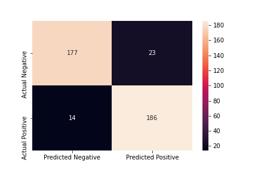 | 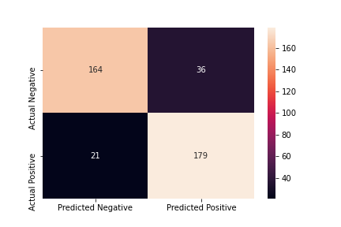

When filter sizes is $5\times5$ instead of $3\times3$, both train accuracy and test accuracy go down a little bit. However, the total parameters are much smaller than the original CNN model(batch64). When units in dense layers change to 32, the accuracy doesn't change much, but the total parameters reduce a lot. And this model(units 32) only take half of the time to fit than the fitting time for the original one(batch64). 

filter5*5(Batch64) | units32(Batch64)
- | - 
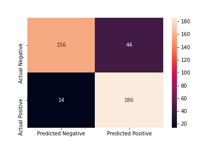 | 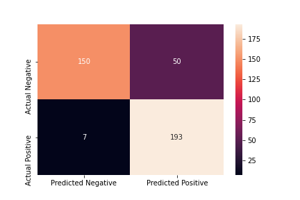

L1 in all Layers(Batch64)| Intercept in all Layers(Batch64)
- | - 
| 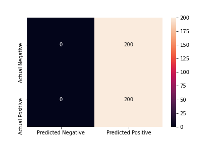

It seems when we regularize and add intercepts among all the layers, the models collapse and predict all the people as positive.

L2 in FC(Batch64) | L1 in FC(Batch64)
- | - 
 | 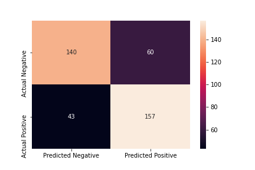

When we regularize with different penalties (L1 and L2 penalty), the number of variables are the same but L2 penalty performs better than L1 penalty.

Global Average Pooling(Batch64)	| Intercept in FC(Batch64)	
- | - 
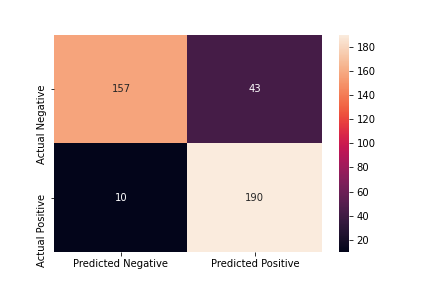| 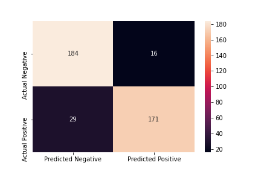

In terms of batch 64, we make some changes and see how the accuracy change. For the model "Global Average Pooling", we replace the flatten layer with global average pooling layer. This change significantly reduces the number of parameters but it seems to cause overfitting problem compared with the original model(Batch 64). And we also try other changes such as regularization and adding intercepts with one as initial. When we add intercepts to the whole layers and regularize all the layers, it seems the CNN model fails. But if we restrict adding intercepts and regularization only to the full connected layers(FC layers), the accuracy of the results at least is better than guessing but not as good as the original model. Only when we initialize bias with one in the fully connected layers, the model performs better than the original model.

### 4.2 Discussion and Tuning of SIFT-SVM

Tuning of K number of clusters in K-mean clustering	| Tuning of C regularization parameter in SVM	
- | - 
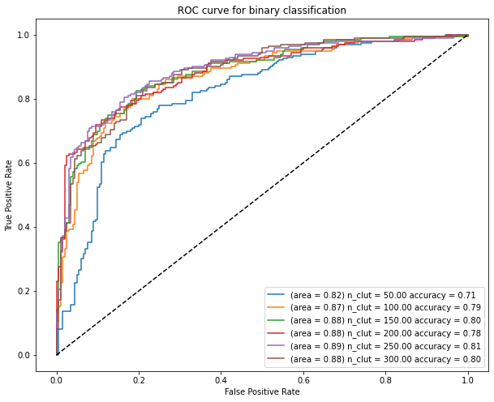| 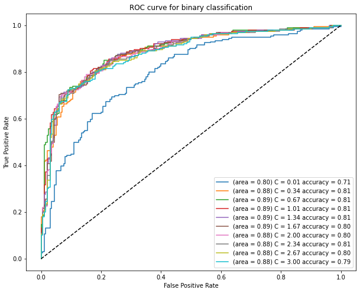

Based on the result, we found that when $C=1$, the models with $K=250$ clusters has the best performance. And when $K=250$, we find only when $k=0.01$, the accuracy and AUC are significantly lower than other models. In other cases, models performs similarly. And considering the accuracy and AUC, when $C$ takes values around 1, SVM method performs the best.

Finally, we plotted the confusion matrix for the model with tuned parameter $C=1$ and $K=250$. 

SVM ROC	| SVM confusion matrix	
- | - 
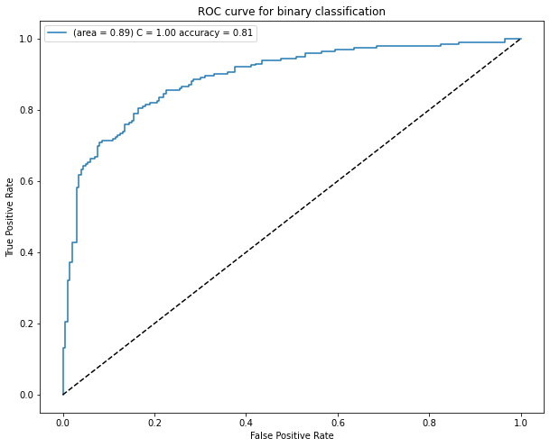| 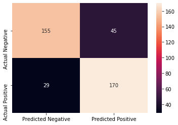

## 5. Conclusions

In this project, we use x-ray imagines of 2158 positive cases and 2158 negative cases as training set and 400 x-ray imagines as test set to make classification between positive and negative cases. Methodologies include convolutional neural network and SIFT-SVM. We cahnge the number of parameters and use other technical tricks like bias and regularization to tune the CNN model. And we find the best CNN model is the model with batch size as 32 although it is somewhat time-consuming. As for SIFT-SVM model, we also tune the the parameter $C$ and $K$ and when $C$ takes values around 1 and $K$ takes value around 250, SVM method performs the best.For the two methods, CNN seems to be more time-consumming which takes around half an hour to fit the model. And SIFT-SVM seems to be faster. But when comes to the accuracy of the predictions, CNN seems to perform better which could give an accuracy of around 90%.

## 6. Reference

[1].Stewart,M.(2019,July 9).Simple Guide to Hyperparameter Tuning in Neural Networks.towards data science.https://towardsdatascience.com/simple-guide-to-hyperparameter-tuning-in-neural-networks-3fe03dad8594

[2].Zhao,Az.(2021,May 13).COVIDx CXR-2-Chest x-ray images for the detection of COVID-19.Kaggle.https://www.kaggle.com/andyczhao/covidx-cxr2?select=test.txt

[3].Deshmukh,H.(2020,November 7).Medical X-ray ⚕️ Image Classification using Convolutional Neural Network.towards data science.https://towardsdatascience.com/medical-x-ray-%EF%B8%8F-image-classification-using-convolutional-neural-network-9a6d33b1c2a

[4].LiveRunGrow (2020,April 16).SIFT (Bag of features) + SVM for classification.Medium.https://liverungrow.medium.com/sift-bag-of-features-svm-for-classification-b5f775d8e55f

[5].Lowe, D. G. (2004). Distinctive image features from scale-invariant keypoints. International journal of computer vision, 60(2), 91-110.

[6].Introduction to SIFT (Scale-Invariant Feature Transform) https://docs.opencv.org/master/da/df5/tutorial_py_sift_intro.html
